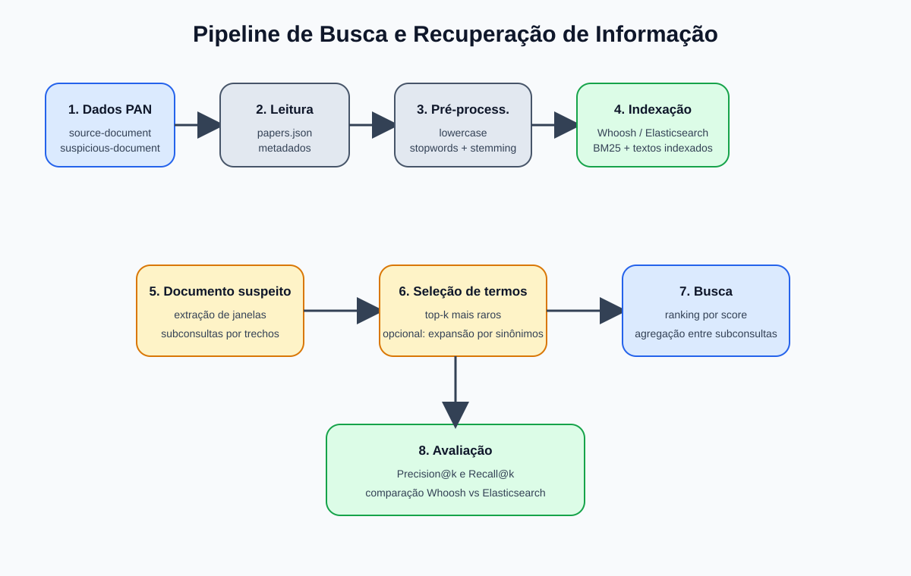
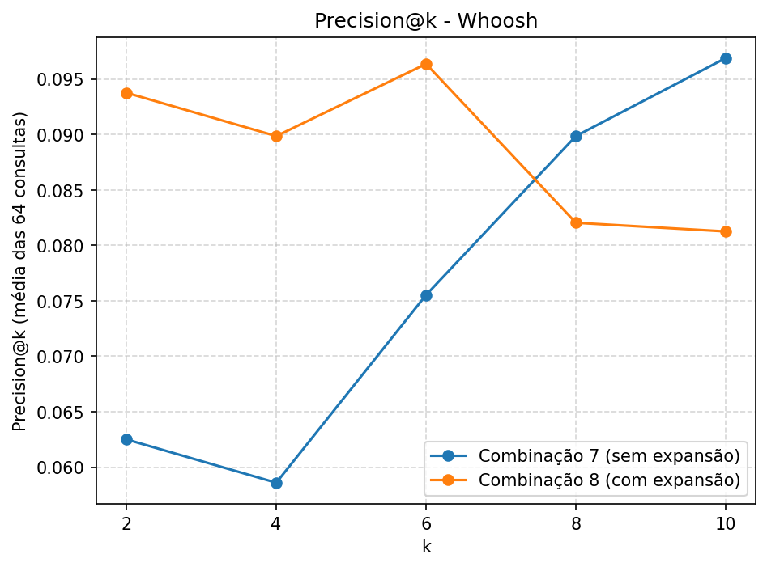
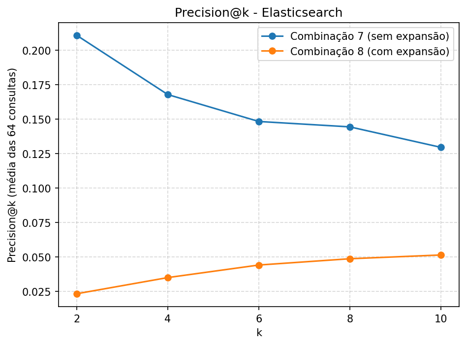
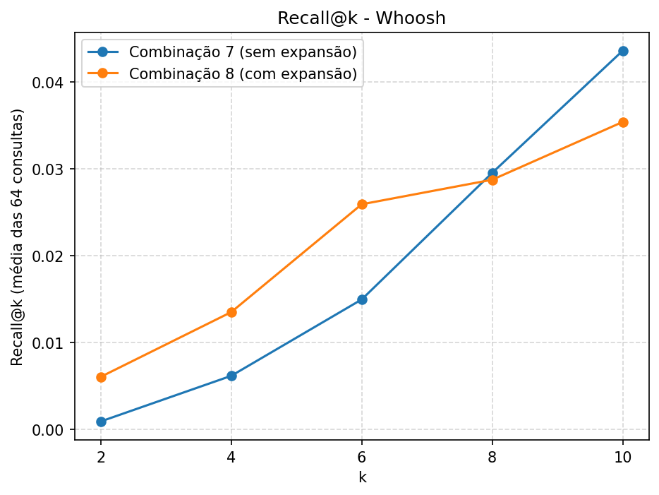
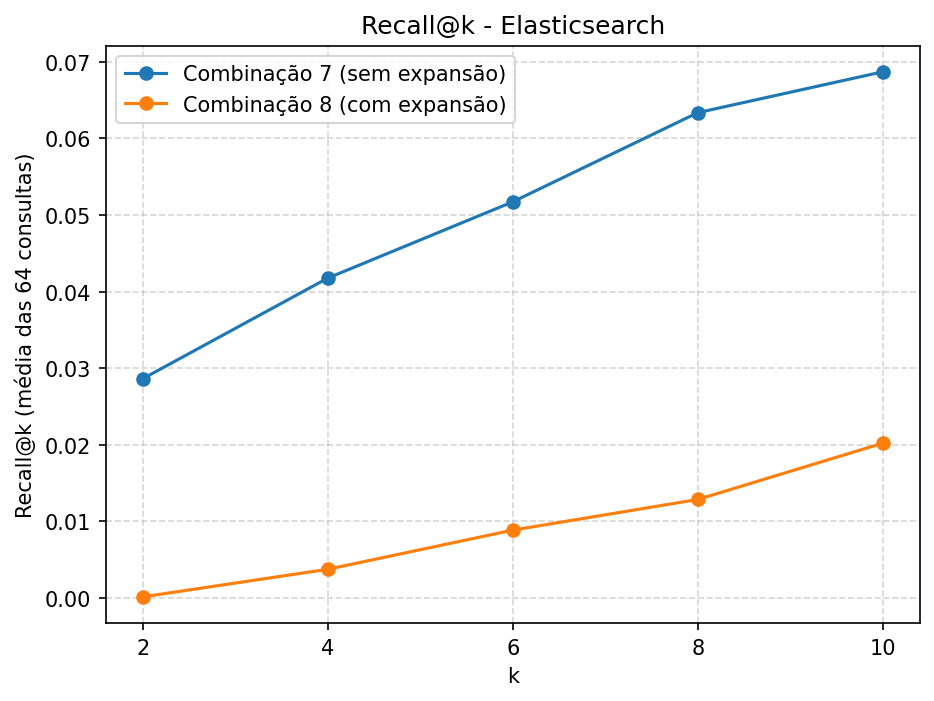
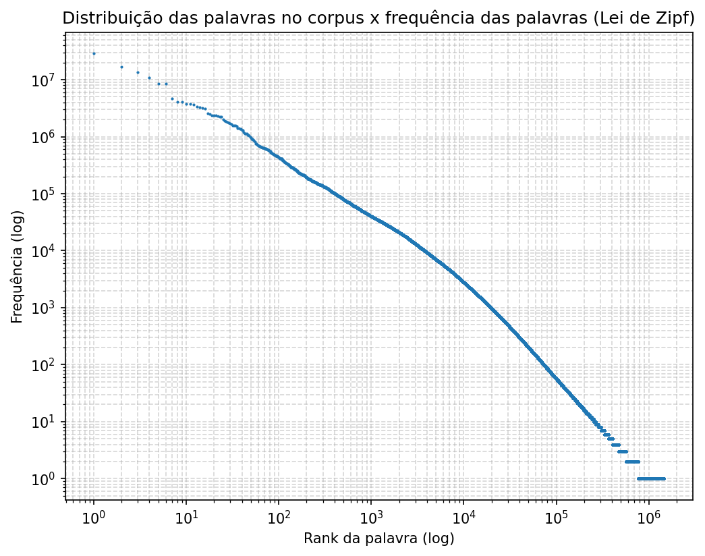
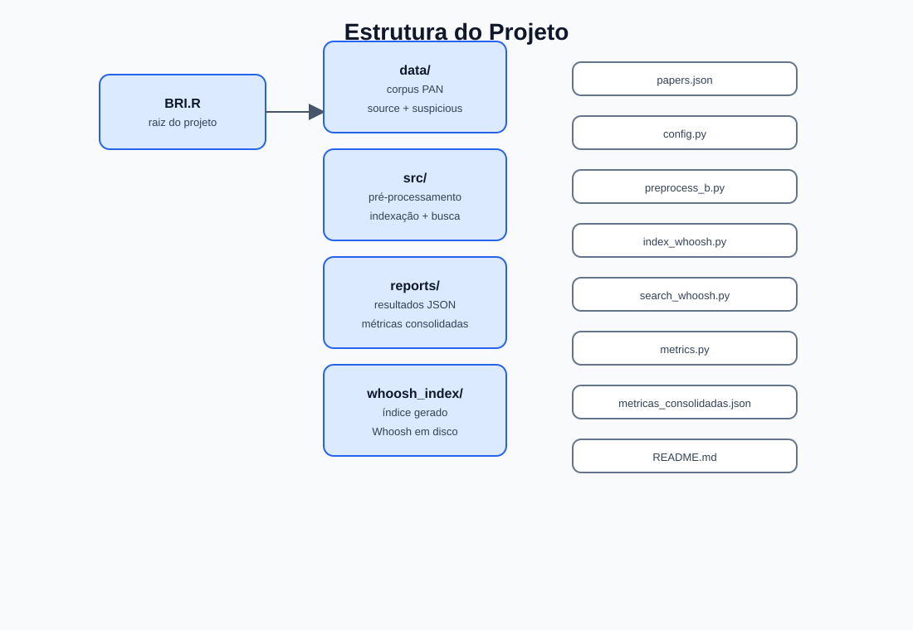

# BRI.R - Motor de Busca para detecção de plágio em textos

Projeto de Busca e Recuperação de Informação desenvolvido para comparar motores de busca baseados em Whoosh e Elasticsearch em uma tarefa de recuperação de documentos fonte a partir de documentos suspeitos, utilizando a coleção PAN Plagiarism Corpus 2011.



## 1. Visão geral

Este trabalho implementa um pipeline de busca e recuperação de informação para o problema de plagiarismo textual:

- o conjunto de documentos suspeitos é usado como consulta;
- cada suspeito é dividido em subconsultas por janelas deslizantes;
- cada subconsulta é pré-processada, filtrada e, em alguns cenários, expandida com sinônimos;
- o motor de busca recupera documentos-fonte candidatos;
- os resultados são agregados por documento e avaliados com Precision@k e Recall@k.

A proposta foi inspirada no enunciado do trabalho de busca e recuperação de informação, em que cada motor deve conter etapas de indexação e busca, além de avaliação de desempenho.

## 2. Objetivo do projeto

O objetivo principal é comparar duas abordagens para recuperação de documentos em uma coleção textual:

- Whoosh
- Elasticsearch

O fluxo foi construído para:

1. indexar os documentos-fonte;
2. processar os documentos suspeitos em subconsultas;
3. selecionar os termos mais relevantes;
4. recuperar os documentos-fonte mais prováveis;
5. avaliar o ranking com os dados de referência do corpus.

## 3. Coleção de dados

O projeto usa a base do PAN Plagiarism Corpus 2011, localizada em:

- `data/pan-plagiarism-corpus-2011/`

Estrutura relevante:

```text
data/
└── pan-plagiarism-corpus-2011/
    ├── papers.json
    ├── external-detection-corpus/
    │   ├── source-document/
    │   │   ├── part1/
    │   │   ├── part2/
    │   │   └── ...
    │   └── suspicious-document/
    │       ├── part1/
    │       ├── part2/
    │       └── ...
```

### 3.1 Dados fonte e suspeitos

- `source-document`: documentos originais presentes no corpus;
- `suspicious-document`: documentos suspeitos, que funcionam como consultas;
- `papers.json`: metadados que conectam cada documento suspeito ao(s) documento(s) fonte correspondente(s).

Essa conexão é fundamental para a avaliação: cada documento suspeito tem um gabarito de documentos-fonte verdadeiros.

## 4. Metodologia adotada

A metodologia foi organizada em etapas bem definidas e corresponde ao fluxo implementado no código.

### 4.1 Pré-processamento

Os documentos são inicialmente lidos e convertidos em tokens. A implementação principal está em:

- `src/preprocess.py`
- `src/preprocess_b.py`

No processamento principal, a abordagem usada foi:

- tokenização por expressão regular;
- conversão para minúsculas;
- remoção de stopwords em inglês;
- stemming com PorterStemmer.

Esse conjunto gera representações mais compactas e mais consistentes para a indexação e busca.

### 4.2 Janelas deslizantes e subconsultas

Os documentos suspeitos são fragmentados em subconsultas usando janelas deslizantes sobre as sentenças:

- `src/sliding_window.py`
- `src/extract_subqueries.py`

A lógica é:

- dividir o texto em sentenças;
- formar blocos de tamanhofixo (janela de 5 sentenças);
- deslizar com passo de 3 sentenças;
- transformar cada janela em uma subconsulta.

Esse procedimento permite capturar trechos relevantes do texto suspeito e reduzir a busca para partes mais específicas do documento.

### 4.3 Seleção de termos e consulta

A ideia é selecionar os termos mais raros dentro de cada subconsulta para formar a consulta de busca. Isso é feito em:

- `src/query_term_selection.py`

A estratégia:

- extrai tokens exclusivos da subconsulta;
- calcula a document frequency do termo no índice;
- ordena pelo termo mais raro;
- seleciona os `k` termos com menor frequência documental.

Isso reduz ruído e prioriza termos mais discriminativos.

### 4.4 Expansão de consulta

Em uma segunda abordagem, foi adicionada expansão semântica de termos com sinônimos do WordNet:

- `src/query_expansion.py`
- `src/extract_subqueries_expanded.py`

O processo:

- remove stopwords;
- gera sinônimos por WordNet;
- expande os tokens da subconsulta;
- aplica stemming;
- usa a subconsulta expandida para a busca.

Essa variante corresponde à combinação 8 do projeto.

### 4.5 Indexação

A indexação foi implementada para os dois motores:

- `src/index_whoosh.py`
- `src/index_elasticsearch.py`

#### Whoosh

- cria o esquema com campo `doc_id` e `content`;
- usa `SimpleAnalyzer`;
- indexa os documentos fonte em disco, em `whoosh_index/`.

#### Elasticsearch

- cria um índice `bri_combo_b`;
- usa `BM25` como similaridade padrão;
- usa o analyzer `whitespace` para evitar processamento excessivo fora do definido no projeto;
- executa a indexação em lotes via `bulk`.

### 4.6 Busca

A busca foi feita por agregação de scores por documento:

- `src/search_whoosh.py`
- `src/search_whoosh2.py`
- `src/search_elasticsearch.py`
- `src/search_elasticsearch2.py`

Para cada documento suspeito:

1. gera subconsultas;
2. seleciona termos mais raros;
3. consulta o índice;
4. soma os scores dos documentos retornados em todas as subconsultas;
5. ordena em ordem decrescente de relevância;
6. mantém os top 10 documentos mais relevantes.

A ideia central é que uma única consulta completa pode ser pouco robusta; ao combinar varios trechos do suspeito, a busca fica mais estável.

## 5. Combinações avaliadas

O projeto trabalha com duas combinações principais:

- Combinação 7: subconsultas sem expansão de termos;
- Combinação 8: subconsultas com expansão de sinônimos.

Em cada uma delas, os resultados foram comparados entre:

- Whoosh
- Elasticsearch

## 6. Avaliação de qualidade

A avaliação foi implementada em:

- `src/precision.py`
- `src/recall.py`
- `src/metrics.py`

Os cálculos usam:

- `Precision@k`
- `Recall@k`
- média sobre todas as consultas do corpus

Os valores foram salvos em JSON em `reports/`.

### 6.1 Resultados consolidados

Os resultados atuais do projeto estão em `reports/metricas_consolidadas.json`.

Abaixo, um resumo dos valores principais:

| Sistema | Precision@2 | Precision@10 | Recall@2 | Recall@10 |
|---|---:|---:|---:|---:|
| Whoosh Combo 7 | 0.0625 | 0.0969 | 0.0009 | 0.0436 |
| Whoosh Combo 8 | 0.0938 | 0.0813 | 0.0060 | 0.0354 |
| Elasticsearch Combo 7 | 0.2109 | 0.1297 | 0.0286 | 0.0687 |
| Elasticsearch Combo 8 | 0.0234 | 0.0516 | 0.0001 | 0.0202 |

Esses números mostram que, no conjunto experimental deste projeto, o Elasticsearch na combinação 7 foi a abordagem mais forte em termos de precisão e recall, enquanto a expansão com sinônimos piorou a performance na maioria dos cenários testados.

## 6.2 Gráficos de avaliação

### Precision@k





### Recall@k





### Distribuição de frequências (Lei de Zipf)



## 7. Organização do projeto



A estrutura principal é a seguinte:

```text
BRI.R/
├── data/
│   └── pan-plagiarism-corpus-2011/
│       ├── papers.json
│       ├── document.xsd
│       ├── readme.txt
│       └── external-detection-corpus/
│           ├── source-document/
│           └── suspicious-document/
├── docs/
│   ├── architecture-flow.svg
│   └── folder-structure.svg
├── reports/
│   ├── metricas_consolidadas.json
│   ├── tempos_busca_preprocessamento.json
│   ├── tempos_indexacao.json
│   ├── whoosh_combo7_results.json
│   ├── whoosh_combo8_results.json
│   ├── es_combo7_results.json
│   ├── es_combo8_results.json
│   ├── log_whoosh_combo7.txt
│   ├── log_whoosh_combo8.txt
│   ├── log_es_combo7.txt
│   ├── log_es_combo8.txt
│   └── log_index_es.txt
├── src/
│   ├── config.py
│   ├── data_loader.py
│   ├── extract_subqueries.py
│   ├── extract_subqueries_expanded.py
│   ├── index_elasticsearch.py
│   ├── index_whoosh.py
│   ├── measure_indexing_time.py
│   ├── measure_query_preprocessing.py
│   ├── metrics.py
│   ├── plot_precision.py
│   ├── plot_recall.py
│   ├── precision.py
│   ├── preprocess.py
│   ├── preprocess_b.py
│   ├── query_expansion.py
│   ├── query_term_selection.py
│   ├── recall.py
│   ├── search_elasticsearch.py
│   ├── search_elasticsearch2.py
│   ├── search_whoosh.py
│   ├── search_whoosh2.py
│   ├── sliding_window.py
│   ├── stopwords_analysis.py
│   ├── top_bottom_words.py
│   ├── word_frequency.py
│   ├── zipf_plot.py
│   └── __pycache__/
├── whoosh_index/
├── .gitignore
├── enunciado_2024-2.pdf
├── pyproject.toml
├── requirements.txt
├── README.md
└── TODO.md
```

## 8. Descrição dos arquivos mais importantes

### `src/config.py`
Define os caminhos globais do projeto, como:

- `BASE_DIR`
- `DATA_DIR`
- `REPORTS_DIR`
- `CORPUS_DIR`
- `SOURCE_DIR`
- `SUSPICIOUS_DIR`
- `PAPERS_JSON`

### `src/data_loader.py`
Carrega os metadados de `papers.json` e monta o índice de arquivos para documentos fonte e suspeitos.

### `src/preprocess.py`
Realiza a tokenização básica e a função de tokenização base.

### `src/preprocess_b.py`
Implementa o pré-processamento principal: tokenização, remoção de stopwords e stemming.

### `src/sliding_window.py`
Cria janelas deslizantes para dividir documentos suspeitos em subconsultas.

### `src/extract_subqueries.py`
Extrai as subconsultas a partir das janelas.

### `src/query_term_selection.py`
Seleciona os termos mais raros da subconsulta para servir como query filtrada.

### `src/query_expansion.py`
Expande termos com sinônimos do WordNet.

### `src/index_whoosh.py`
Cria o índice Whoosh e indexa os documentos fonte.

### `src/index_elasticsearch.py`
Cria o índice Elasticsearch e faz a indexação via bulk.

### `src/search_whoosh.py`
Executa a busca por subconsultas no Whoosh e agrega os resultados.

### `src/search_elasticsearch.py`
Executa a busca por subconsultas no Elasticsearch e agrega os resultados.

### `src/metrics.py`
Le os arquivos JSON de resultados e calcula precision e recall médios para cada estratégia.

### `reports/`
Arquivos de saída com resultados de busca e métricas consolidadas.

## 9. Passo a passo para executar o projeto

### 9.1 Preparar ambiente

```bash
python -m venv .venv
source .venv/bin/activate
pip install -r requirements.txt
```

Ou, se preferir usar o ambiente configurado pelo projeto:

```bash
pip install -e .
```

### 9.2 Verificar dependências

O arquivo `pyproject.toml` já define as dependências principais:

- whoosh
- elasticsearch
- nltk
- matplotlib
- pandas

### 9.3 Iniciar o Elasticsearch

O projeto assume que o Elasticsearch está rodando localmente em:

```text
http://localhost:9200
```

Antes de criar o índice, certifique-se de que a instância esteja ativa.

### 9.4 Rodar a indexação do Whoosh

```bash
python src/index_whoosh.py
```

### 9.5 Rodar a indexação do Elasticsearch

```bash
python src/index_elasticsearch.py
```

### 9.6 Executar busca no Whoosh

```bash
python src/search_whoosh.py
```

### 9.7 Executar busca no Elasticsearch

```bash
python src/search_elasticsearch.py
```

### 9.8 Calcular métricas

```bash
python src/metrics.py
```

## 10. Fluxo geral do pipeline

```mermaid
flowchart LR
    A[Dados PAN Corpus] --> B[Leitura e metadados]
    B --> C[Pré-processamento]
    C --> D[Janela deslizante]
    D --> E[Subconsultas]
    E --> F[Seleção de termos]
    F --> G[Whoosh / Elasticsearch]
    G --> H[Ranking de documentos]
    H --> I[Agregação por documento]
    I --> J[Precision@k / Recall@k]
    J --> K[Relatório final em JSON]
```

## 11. Principais conclusões

- O projeto validou o uso de subconsultas como estratégia de recuperação para documentos suspeitos;
- o processo de selecionar termos mais raros melhorou a discriminação dentro de cada janela;
- a expansão por sinônimos não trouxe ganho consistente no conjunto experimental;
- o Elasticsearch ficou melhor em precisão e recall no experimento mais relevante;
- a comparação entre os dois motores mostrou que a arquitetura da busca e a forma de construção das subconsultas têm impacto direto no desempenho.

## 12. Observações finais

Este projeto foi estruturado para ser didático e extensível. O código está dividido em módulos curtos e tem funções bem isoladas, o que facilita:

- análise do pipeline;
- troca de motores de busca;
- ajuste de parâmetros;
- avaliação de novas combinações de pré-processamento e expansão.

A arquitetura também segue a lógica da disciplina de recuperação de informação: leitura dos documentos, representação, indexação, busca, rankeamento e avaliação.

---

Se você quiser, no próximo passo posso complementar este README com:

- seção de resultados em gráfico;
- instruções específicas para rodar cada script em ordem;
- pequenas capturas de tela do fluxo em terminal;
- versão mais curta para GitHub + versão completa para relatório acadêmico.
